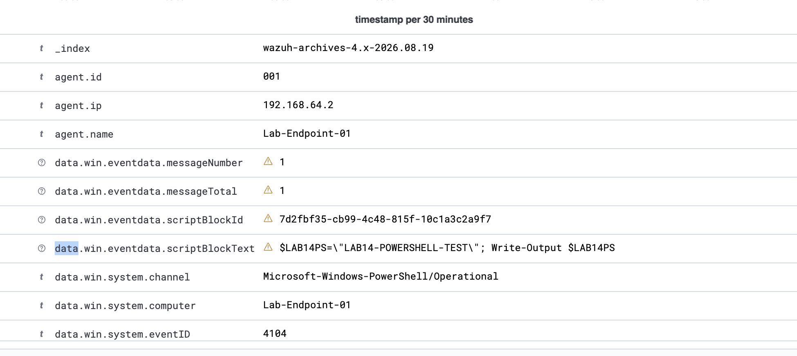
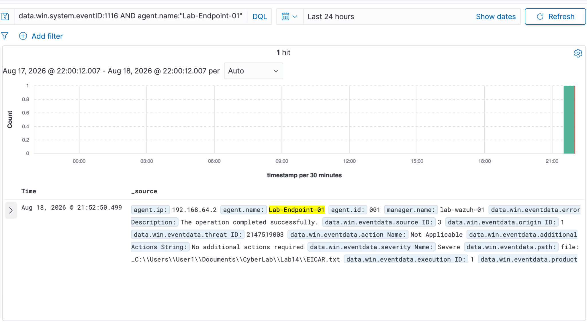

# Cybersecurity Home Lab — SOC Detection & Incident Response

A completed 15-lab Blue Team / SOC portfolio demonstrating Windows endpoint monitoring, event-log analysis, Sysmon telemetry, PowerShell visibility, network detection, persistence analysis, DNS investigation, Microsoft Defender alert triage, centralized SIEM ingestion, incident investigation, and multi-source security-event correlation.

**Status:** Complete — 15 documented investigations

**Core stack:** Wazuh SIEM · Sysmon · Microsoft Defender · PowerShell · Windows Event Logs · Kali Linux · Nmap · Netcat · UTM

## Project Goal

Build and investigate realistic, controlled security activity using a monitored Windows endpoint, a Kali Linux test system, and a centralized Wazuh SIEM.

The analyst workflow used throughout the project is:

**Generate activity → Collect telemetry → Investigate → Correlate evidence → Document findings**

All testing is performed in a personally controlled virtual lab.

## Lab Architecture

```text
                         MacBook Air M4
                              |
                             UTM
                              |
                     Virtual Lab Network
                   /           |           \
                  /            |            \
       LAB-ENDPOINT-01    LAB-WAZUH-01    LAB-KALI-01
         Windows 11        Ubuntu/Wazuh      Kali Linux
             |                  |                |
    Windows Event Logs     Wazuh Manager   Controlled tests
           Sysmon            Indexer       Nmap / Netcat
    PowerShell logging       Dashboard
    Microsoft Defender       Filebeat
             |                  |
             +-------> Centralized SIEM
                         Detection & Analysis
```

| System | Role | Lab IP |
|---|---|---|
| `LAB-ENDPOINT-01` | Monitored Windows 11 endpoint | `192.168.64.2` |
| `LAB-KALI-01` | Controlled traffic/test system | `192.168.64.3` |
| `LAB-WAZUH-01` | Wazuh SIEM server | `192.168.64.4` |

## Evidence Highlights

### Centralized PowerShell Visibility



Wazuh Discover displaying PowerShell Event ID `4104` from `Lab-Endpoint-01`, including captured script-block content. This validates end-to-end collection from the Windows endpoint into the centralized SIEM.

### Microsoft Defender Detection in Wazuh



Microsoft Defender Event ID `1116` indexed in Wazuh for the controlled EICAR test artifact, demonstrating centralized alert visibility with endpoint, severity, threat, and file-path context.

### Encoded PowerShell Investigation


Sysmon Event ID `1` from the capstone showing a medium-integrity PowerShell child launched with `-EncodedCommand`, providing the process context used to pivot into PowerShell Script Block Logging.

### Defender Containment Confirmation


Microsoft Defender Event ID `1117` confirming quarantine and `No additional actions required`, providing evidence that the detected EICAR artifact was successfully contained.

## Portfolio Highlights

### Port-Scan Detection
Generated a controlled Nmap SYN scan and detected the activity from the Windows endpoint perspective using Windows Firewall logs and Windows Filtering Platform events. Correlated a rapid one-to-many-port probe pattern across TCP ports `21, 22, 23, 80, 443, 445, 3389, 8080`.

[View investigation](docs/06-port-scan-detection.md)

### Process-to-Network Correlation
Correlated Sysmon Event ID `1` and Event ID `3` to connect a `curl.exe` process to an outbound HTTP connection. Used PID, destination, direction, command line, precise UTC timestamps, and an independent Kali HTTP log to reconstruct the activity.

[View investigation](docs/07-process-network-correlation.md)

### PowerShell Script Block Analysis
Enabled PowerShell Script Block Logging and correlated Sysmon Event ID `1` with PowerShell Event ID `4104`. Demonstrated how Sysmon exposes `-EncodedCommand` while Event ID `4104` reveals the readable PowerShell code executed by the same process.

[View investigation](docs/08-powershell-script-block-logging.md)

### File Creation and Hash Analysis
Expanded the Sysmon configuration to collect Event ID `11`, correlated process creation with file creation using PID and ProcessGuid, calculated a SHA-256 fingerprint, and demonstrated that renaming a file does not change its content hash.

[View investigation](docs/09-file-creation-hashing.md)

### Registry Persistence Detection
Added targeted Sysmon registry monitoring for the Windows `Run` key, generated a benign startup entry, and correlated Sysmon Event ID `13` with Event ID `1` using PID and ProcessGuid to identify the process responsible for the persistence-related registry modification.

[View investigation](docs/10-registry-persistence-detection.md)

### DNS Query Correlation
Captured a controlled DNS lookup with Sysmon Event ID `22` and correlated it with Event ID `1` using matching PID, ProcessGuid, process command line, user context, and timestamps only ~37 ms apart.

[View investigation](docs/11-dns-query-correlation.md)

### Microsoft Defender Alert Triage
Validated Microsoft Defender Real-Time Protection with a benign EICAR test artifact, analyzed Defender Event IDs `1116` and `1117`, and correlated the detection and successful quarantine with Sysmon process and file-creation telemetry.

[View investigation](docs/12-defender-detection-triage.md)

### Scheduled Task Persistence Detection
Enabled the Windows audit policy required for scheduled-task creation telemetry, compared failed medium-integrity and successful high-integrity `schtasks.exe` activity, and correlated Sysmon Event ID `1` with Windows Security Event ID `4698` for a logon-triggered task.

[View investigation](docs/13-scheduled-task-persistence-detection.md)

### Wazuh SIEM and Centralized Telemetry
Deployed a Wazuh SIEM server, enrolled the Windows endpoint, and centralized Sysmon, PowerShell, and Microsoft Defender telemetry. Enabled searchable raw-event archives and verified end-to-end ingestion using Sysmon Event ID `1`, PowerShell Event ID `4104`, and Defender Event IDs `1116/1117`.

[View investigation](docs/14-wazuh-siem-centralized-telemetry.md)

### SOC Capstone Investigation
Investigated a controlled multi-stage endpoint scenario in Wazuh, beginning with a Defender detection and working backward through encoded PowerShell, file creation, DNS, outbound HTTPS, registry persistence, and remediation telemetry. Correlated events using PID, ProcessGuid, timestamps, parent-child relationships, DNS results, destination IPs, and user context to reconstruct the incident and determine scope, containment, and disposition.

[View investigation](docs/15-soc-capstone-investigation.md)

## Skills Demonstrated

- Wazuh SIEM deployment, agent enrollment, and centralized telemetry analysis
- Raw-event indexing and threat hunting with Wazuh Discover
- SOC alert triage, investigation, scope determination, and disposition
- Alert-to-root-activity pivoting and timeline reconstruction
- Windows Event Viewer and Security log analysis
- Sysmon configuration and telemetry analysis
- Microsoft Defender Antivirus alert and remediation analysis
- Windows Filtering Platform event analysis
- PowerShell Script Block Logging
- Windows registry and startup-persistence analysis
- Scheduled-task persistence analysis
- Windows advanced audit-policy configuration and validation
- Process privilege and integrity-level comparison
- DNS-query and resolution analysis
- Process and parent-child process analysis
- TCP/IP and port-level traffic analysis
- Nmap and Netcat in an authorized lab environment
- Windows Firewall logging and policy inspection
- Event correlation across multiple telemetry sources
- Timeline reconstruction using UTC and local timestamps
- SHA-256 hashing and file-artifact analysis
- PowerShell-based log querying and structured XML parsing
- Handling incomplete telemetry without overclaiming
- Technical security documentation

## Investigations

| Document | Focus |
|---|---|
| [01 — Lab Architecture](docs/01-lab-architecture.md) | Three-VM architecture, roles, network, and telemetry flow |
| [02 — Windows Event Logs](docs/02-windows-event-logs.md) | Authentication-event analysis with 4624/4625 |
| [03 — Sysmon Monitoring](docs/03-sysmon-monitoring.md) | Process, network, DNS, file, and registry telemetry |
| [04 — Network Connectivity](docs/04-network-connectivity.md) | Network validation and host-role mapping |
| [05 — TCP 8080 Investigation](docs/05-tcp-8080-investigation.md) | Inbound TCP connection and Sysmon Event ID 3 |
| [06 — Port-Scan Detection](docs/06-port-scan-detection.md) | Nmap reconnaissance detection with WFP events |
| [07 — Process-to-Network Correlation](docs/07-process-network-correlation.md) | Sysmon Event IDs 1 + 3 and timeline reconstruction |
| [08 — PowerShell Script Block Logging](docs/08-powershell-script-block-logging.md) | Encoded PowerShell analysis with Event ID 4104 |
| [09 — File Creation and Hashing](docs/09-file-creation-hashing.md) | Sysmon Event ID 11, ProcessGuid, and SHA-256 |
| [10 — Registry Persistence Detection](docs/10-registry-persistence-detection.md) | Sysmon Event ID 13 and process-to-registry correlation |
| [11 — DNS Query Correlation](docs/11-dns-query-correlation.md) | Sysmon Event ID 22 and process-to-DNS correlation |
| [12 — Defender Detection and Triage](docs/12-defender-detection-triage.md) | Defender 1116/1117 with Sysmon process/file correlation |
| [13 — Scheduled Task Persistence Detection](docs/13-scheduled-task-persistence-detection.md) | Security 4698, Sysmon process telemetry, and privilege comparison |
| [14 — Wazuh SIEM and Centralized Telemetry](docs/14-wazuh-siem-centralized-telemetry.md) | Wazuh deployment, raw archives, and centralized Sysmon/PowerShell/Defender ingestion |
| [15 — SOC Capstone Investigation](docs/15-soc-capstone-investigation.md) | Multi-stage Wazuh investigation, correlation, scope, containment, and disposition |

## Security and Scope

All activity documented here is generated inside an isolated, personally controlled lab for defensive learning and detection engineering practice.

The repository contains sanitized investigation write-ups only. Virtual machine images, credentials, secrets, private keys, tokens, and other sensitive material are not stored here.
