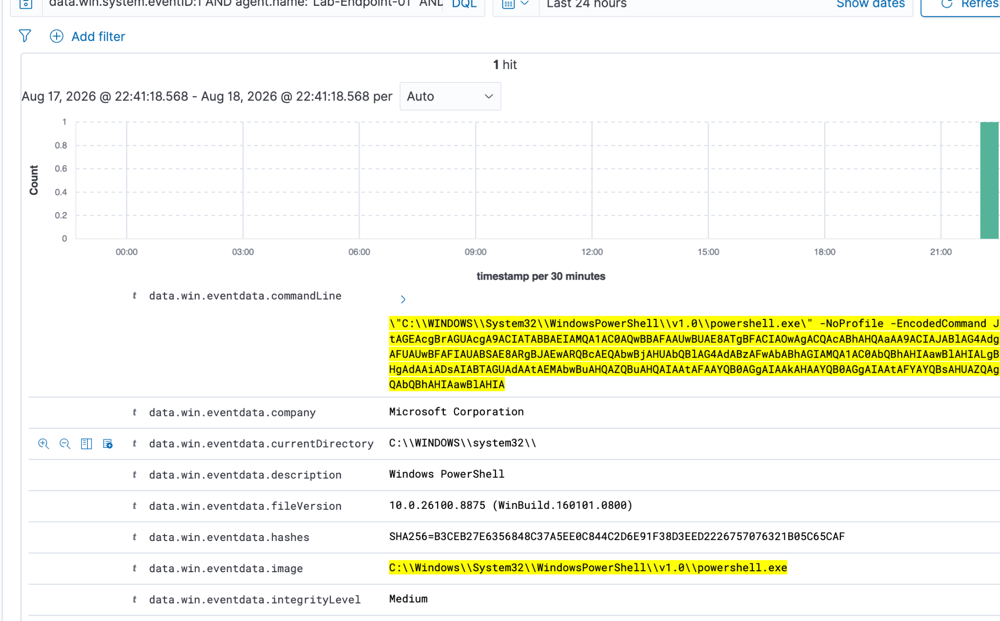
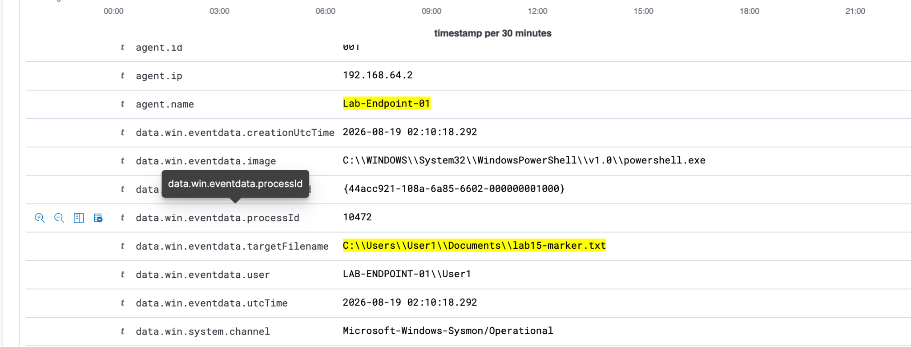
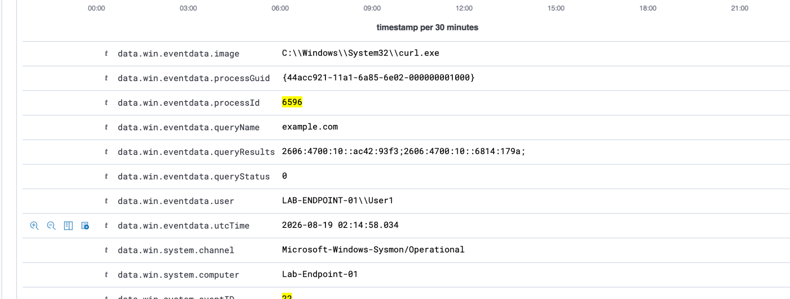
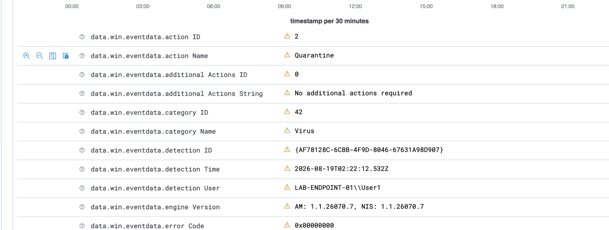

# Lab 15 — SOC Capstone Investigation

## Objective

Perform an end-to-end SOC investigation in Wazuh by starting from a Microsoft Defender detection and reconstructing the surrounding endpoint activity across Sysmon, PowerShell Script Block Logging, DNS, network, registry, and file-creation telemetry.

## Environment and Tools

- `LAB-ENDPOINT-01` — Windows 11 endpoint, `192.168.64.2`
- `LAB-WAZUH-01` — Wazuh SIEM, `192.168.64.4`
- Wazuh Discover with `wazuh-archives-*`
- Sysmon
- PowerShell Script Block Logging
- Microsoft Defender Antivirus

All activity was generated inside an authorized, personally controlled lab using benign test artifacts.

## Scenario

A controlled sequence was generated to resemble a suspicious endpoint timeline:

1. A normal-user PowerShell session launched a child PowerShell process with `-EncodedCommand`.
2. The decoded script created `C:\Users\User1\Documents\lab15-marker.txt`.
3. `curl.exe` resolved `example.com` and made an outbound HTTPS connection.
4. PowerShell created a Run-key value named `Lab15Update` with the value `notepad.exe`.
5. PowerShell downloaded the standard EICAR antivirus test artifact into the Lab 15 directory.
6. Microsoft Defender detected and quarantined the EICAR test file.

The investigation began from the Defender alert and worked backward through Wazuh to reconstruct cause, scope, and containment.

## Investigation Evidence

### 1. Encoded PowerShell Process

Sysmon Event ID `1` recorded a PowerShell child process launched with `-NoProfile -EncodedCommand`.

- UTC: `2026-08-19 02:10:18.096`
- Process ID: `10472`
- ProcessGuid: `{44acc921-108a-6a85-6602-000000001000}`
- Image: `C:\Windows\System32\WindowsPowerShell\v1.0\powershell.exe`
- Integrity level: `Medium`
- Parent process: `powershell.exe`
- Parent PID: `3652`
- ParentProcessGuid: `{44acc921-1081-6a85-6202-000000001000}`
- User: `LAB-ENDPOINT-01\User1`

*Sysmon Event ID `1` showing the capstone PowerShell child process launched with `-EncodedCommand`, including process and integrity context used for correlation.*

PowerShell Event ID `4104` exposed the readable script content, including the `LAB15-CAPSTONE` marker and the target path for `lab15-marker.txt`.

### 2. File-Creation Correlation

Sysmon Event ID `11` recorded creation of:

`C:\Users\User1\Documents\lab15-marker.txt`

- UTC: `2026-08-19 02:10:18.292`
- Process ID: `10472`
- ProcessGuid: `{44acc921-108a-6a85-6602-000000001000}`
- Image: `powershell.exe`
- User: `LAB-ENDPOINT-01\User1`

*Sysmon Event ID `11` showing `lab15-marker.txt` created by PID `10472`. The matching PID and ProcessGuid tie the artifact directly to the encoded PowerShell process.*

The PID and ProcessGuid exactly matched the encoded PowerShell process. The file was created approximately 196 ms after process creation.

### 3. DNS and Outbound HTTPS Correlation

Sysmon Event ID `1` recorded `curl.exe`:

- UTC: `2026-08-19 02:14:57.977`
- Process ID: `6596`
- ProcessGuid: `{44acc921-11a1-6a85-6e02-000000001000}`
- Image: `C:\Windows\System32\curl.exe`
- Integrity level: `Medium`
- Parent: PowerShell PID `3652`
- User: `LAB-ENDPOINT-01\User1`

Sysmon Event ID `22` followed approximately 57 ms later:

- UTC: `2026-08-19 02:14:58.034`
- Process ID: `6596`
- ProcessGuid: `{44acc921-11a1-6a85-6e02-000000001000}`
- Query: `example.com`
- Query status: `0`
- Results included `2606:4700:10::ac42:93f3`

*Sysmon Event ID `22` showing PID `6596` (`curl.exe`) resolving `example.com`, providing the DNS evidence used to correlate the subsequent outbound HTTPS connection.*

Sysmon Event ID `3` then recorded an initiated TCP connection from PID `6596` to:

- Destination: `2606:4700:10::ac42:93f3`
- Destination port: `443`
- Protocol: TCP
- Direction: initiated outbound

The Event ID `3` record contained an unknown image and zeroed ProcessGuid, so the connection was correlated using the matching PID, DNS result, destination address, port, and timeline rather than overclaiming process-image attribution.

### 4. Registry Persistence Activity

Sysmon Event ID `13` recorded a Run-key modification:

- UTC: `2026-08-19 02:16:03.320`
- Event type: `SetValue`
- Image: `powershell.exe`
- Process ID: `3652`
- ProcessGuid: `{44acc921-1081-6a85-6202-000000001000}`
- Target: `HKU\<User SID>\Software\Microsoft\Windows\CurrentVersion\Run\Lab15Update`
- Value: `notepad.exe`
- User: `LAB-ENDPOINT-01\User1`

This tied the persistence-related registry change to the same interactive PowerShell session that launched the encoded PowerShell child and `curl.exe`.

### 5. Defender Detection and Containment

PowerShell downloaded the standard EICAR test artifact to:

`C:\Users\User1\Documents\CyberLab\Lab15\EICAR.txt`

PowerShell Event ID `4104` captured the `Invoke-WebRequest` command referencing `secure.eicar.org` and the Lab 15 output path.

Microsoft Defender Event ID `1116` identified:

- Threat: `Virus:DOS/EICAR_Test_File`
- Severity: `Severe`
- Source: Real-Time Protection
- Origin: Local machine
- Process: `powershell.exe`
- Path: `C:\Users\User1\Documents\CyberLab\Lab15\EICAR.txt`

Microsoft Defender Event ID `1117` confirmed remediation:

- Action: `Quarantine`
- Additional actions: `No additional actions required`
- Error code: `0x00000000`
- Detection user: `LAB-ENDPOINT-01\User1`

*Microsoft Defender Event ID `1117` confirming successful quarantine of the EICAR test artifact and reporting `No additional actions required`.*

A subsequent filesystem check confirmed the EICAR file was no longer present.

## Reconstructed Timeline

| UTC Time | Evidence | Analyst Interpretation |
|---|---|---|
| `02:10:18.096` | Sysmon 1 — PowerShell `-EncodedCommand`, PID 10472 | Suspicious-looking encoded PowerShell child launched from normal-user PowerShell |
| `02:10:18.292` | Sysmon 11 — `lab15-marker.txt` | Same PID/ProcessGuid created the file artifact |
| `02:14:57.977` | Sysmon 1 — `curl.exe`, PID 6596 | Network-capable process launched from the same interactive PowerShell session |
| `02:14:58.034` | Sysmon 22 — `example.com` | `curl.exe` resolved the target domain |
| Shortly after | Sysmon 3 — destination `2606:4700:10::ac42:93f3:443` | Outbound HTTPS connection matched the DNS result and PID |
| `02:16:03.320` | Sysmon 13 — `Lab15Update=notepad.exe` | PowerShell modified the user Run key, a persistence-relevant location |
| Later | PowerShell 4104 — `Invoke-WebRequest` to EICAR URL | PowerShell initiated the download that led to the Defender detection |
| Later | Defender 1116 | EICAR test artifact detected by real-time protection |
| Later | Defender 1117 | Artifact successfully quarantined; no additional action required |

## Findings

The investigation identified a coherent sequence of activity on a single endpoint under `User1`. A normal-user PowerShell session launched encoded PowerShell, created a file artifact, launched `curl.exe`, generated DNS and outbound HTTPS telemetry, modified a Run-key persistence location, and later downloaded an EICAR test artifact that Microsoft Defender detected and quarantined.

The activity was intentionally generated as an authorized benign lab simulation. The appropriate disposition is **true-positive security telemetry generated by controlled test activity**, with successful containment of the EICAR artifact. No evidence observed in the collected telemetry indicated spread to another endpoint.

## Skills Demonstrated

- SIEM-based alert triage and investigation
- Alert-to-root-activity pivoting
- Cross-source event correlation
- Sysmon Event IDs `1`, `3`, `11`, `13`, and `22`
- PowerShell Event ID `4104` analysis
- Microsoft Defender Event IDs `1116` and `1117`
- PID and ProcessGuid correlation
- Parent-child process analysis
- DNS-to-network correlation
- Registry persistence analysis
- Timeline reconstruction using UTC timestamps
- Handling incomplete telemetry without overclaiming
- Scope, containment, and incident-disposition determination
